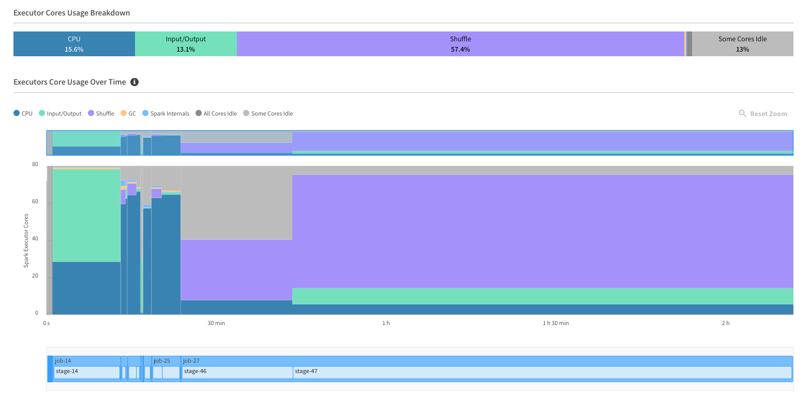
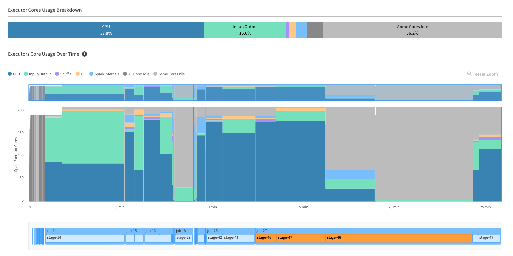
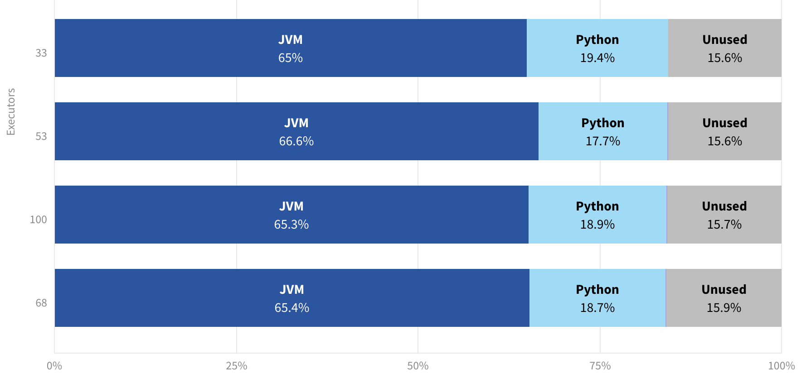
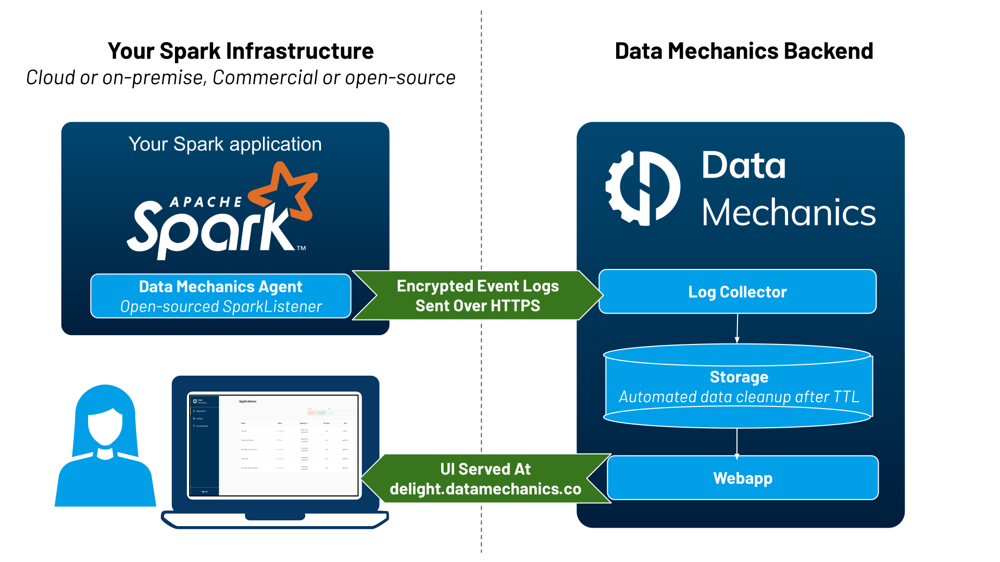

# Delight - The New & Improved Spark UI and Spark History Server

[Delight](https://www.datamechanics.co/delight) is a free Spark UI & Spark History Server alternative with new metrics and visualizations that will delight you!

The Delight project is developed by [Data Mechanics](https://www.datamechanics.co), which is now part of the [Spot](https://spot.io) family. Delight works on top of any Spark platform, whether it's open-source or commercial, in the cloud or on-premise.

## Overview

The [Delight web dashboard](https://sparklistener.lucia.montara.io) lists your completed Spark applications with high-level information and metrics.

<p align="center">
<a href="documentation/images/sparklistener_dashboard.png"></a>
</p>

When you click on a specific application, you access an overview screen for this application. It contains a graph of your Executor Cores Usage, broken down by categories. This graph is aligned with a timeline of your Spark jobs and stages, so that it's easy for you to correlate CPU metrics with the code of your Spark application.

For example, Delight made it obvious that this application (left) suffered from a slow shuffle.
After using instances with mounted local SSDs (right), the application performance improved by over 10x.

<a href="documentation/images/before.png"></a>
<a href="documentation/images/after.png"></a>

Under this graph, you will get a report of the peak memory usage of your Spark executors (the overview screen shows the top 5 executors). This graph should help you tune your container memory sizes - so that memory usage stays in the 70-90% range. This graph breaks down memory usage between JVM, Python, and other processes (at the time of the peak total usage).

<p align="center">
<a href="documentation/images/memory.png"></a>
</p>

Delight also runs a Spark History Server for you, so it's a great way to access the Spark UI, without having to setup and maintain a Spark History Server yourself.

## History & Roadmap

- June 2020: Project starts with a widely shared [blog post](https://www.datamechanics.co/blog-post/building-a-better-spark-ui-data-mechanics-delight) detailing our vision.
- November 2020: [First release](https://www.datamechanics.co/blog-post/were-releasing-a-free-cross-platform-spark-ui-and-spark-history-server). A dashboard with one-click access to a Hosted Spark History Server (Spark UI).
- March 2021: Beta release of the overview screen with Executor CPU metrics and Spark timeline.
- April 2021: [Delight is Generally Available](https://www.datamechanics.co/blog-post/delight-the-new-improved-spark-ui-spark-history-server-is-now-ga)! The overview screen now displays the executors peak memory usage, broken down by the type of memory usage (Java, Python, other processes).
- June 2022: The list of executors and the memory over time of each executor is available. Overall UI is updated following the [acquisiton of Data Mechanics by Spot](https://spot.io/blog/accelerating-wave-big-data/)
- Coming Next: Driver memory usage, Automated tuning recommendations, Make Delight accessible while the app is running.

## Architecture

Delight consists of an open-sourced agent, which runs inside your Spark application (using the [SparkListener](https://mallikarjuna_g.gitbooks.io/spark/content/spark-SparkListener.html) interface).



This agent streams Spark events to Delight backend. These contain metadata about your Spark application execution: how long each task took, how much data was read & written, how much memory was used, etc. These logs do not contain sensitive information like the data that your Spark application is processing. Here's a [sample Spark event](documentation/resources/example_spark_event_log_message.json) and a [full Spark event log](documentation/resources/example_spark_event_log.txt).

Once your application is finished, it becomes available on the Delight hosted [dashboard](https://sparklistener.lucia.montara.io). It gives you access to high-level metrics, to a new Delight screen showing CPU & Memory metrics, and to the Spark UI.

## Installation

To use Delight:

- Sign in through our [website](https://sparklistener.lucia.montara.io) using your Google account. If you want to share a single Delight dashboard, you should use your company's Google account.
- Head to settings on the left navigation bar, and create a personal access token. This token will uniquely identify your applications in Delight - treat it as a secret.
- Follow the installation instructions below for your platform.

Here are the available instructions:

- [Local run with the `spark-submit` CLI](documentation/local_run.md)
- [Generic instructions for the `spark-submit` CLI](documentation/spark_submit.md)
- [AWS EMR](documentation/aws_emr.md)
- [AWS EMR on EKS](documentation/aws_emr_eks.md)
- [Google Cloud Dataproc](documentation/dataproc.md)
- [Spark on Kubernetes operator](documentation/spark_operator.md)
- [Databricks](documentation/databricks.md)
- [Apache Livy](documentation/apache_livy.md)

## Compatibility

Delight is compatible with Spark `2.4.0` to Spark `3.1.1` with the following Maven coordinates:

`io.montara.lucia:sparklistener_<replace-with-your-scala-version-2.11-or-2.12>:latest-SNAPSHOT`

We also maintain a version compatible with Spark `2.3.x`.
Please use the following Maven coordinates to use it:

`io.montara.lucia:sparklistener_2.11:2.3-latest-SNAPSHOT`

**Delight is compatible with Pyspark.**
But even if you use Python, you'll have to determine the Scala version used by your Spark distribution and fill out the placeholder above in the Maven coordinates!

## Configurations

| Config                                         | Explanation                                                                                                                       | Default value    |
| :--------------------------------------------- | :-------------------------------------------------------------------------------------------------------------------------------- | :--------------- |
| `spark.lucia.sparklistener.accessToken.secret` | An access token to authenticate yourself with Delight. If the access token is missing, the listener will not stream events        | (none)           |
| `spark.lucia.sparklistener.appNameOverride`    | The name of the app that will appear in Delight. This is only useful if your platform does not allow you to set `spark.app.name`. | `spark.app.name` |

### Advanced configurations

We've listed more technical configurations in this section for completeness.
You should not need to change the values of these configurations though, so drop us a line if you do, we'll be interested to know more!

| Config                                                              | Explanation                                                                                                                                                                                                                               | Default value                                         |
| :------------------------------------------------------------------ | :---------------------------------------------------------------------------------------------------------------------------------------------------------------------------------------------------------------------------------------- | :---------------------------------------------------- |
| `spark.lucia.sparklistener.collector.url`                           | URL of the Delight collector API                                                                                                                                                                                                          | https://api.sparklistener.lucia.montara.io/collector/ |
| `spark.lucia.sparklistener.buffer.maxNumEvents`                     | The number of Spark events to reach before triggering a call to Delight Collector API. Special events like job ends also trigger a call.                                                                                                  | 1000                                                  |
| `spark.lucia.sparklistener.payload.maxNumEvents`                    | The maximum number of Spark events to be sent in one call to Delight Collector API.                                                                                                                                                       | 10000                                                 |
| `spark.lucia.sparklistener.heartbeatIntervalSecs`                   | (Internal config) the interval at which the listener send an heartbeat requests to the API. It allow us to detect if the app was prematurely finished and start the processing ASAP                                                       | 10s                                                   |
| `spark.lucia.sparklistener.pollingIntervalSecs`                     | (Internal config) the interval at which the object responsible for calling the API checks whether there are new payloads to be sent                                                                                                       | 0.5s                                                  |
| `spark.lucia.sparklistener.maxPollingIntervalSecs`                  | (Internal config) upon connection error, the polling interval increases exponentially until this value. It returns to its initial value once a call to the API passes through                                                             | 60s                                                   |
| `spark.lucia.sparklistener.maxWaitOnEndSecs`                        | (Internal config) the time the Spark application waits for remaining payloads to be sent after the event `SparkListenerApplicationEnd`. Not applicable in the case of Databricks                                                          | 10s                                                   |
| `spark.lucia.sparklistener.waitForPendingPayloadsSleepIntervalSecs` | (Internal config) the interval at which the object responsible for calling the API checks whether there are new remaining to be sent, after the event `SparkListenerApplicationEnd` is received. Not applicable in the case of Databricks | 1s                                                    |
| `spark.lucia.sparklistener.logDuration`                             | (Debugging config) whether to log the duration of the operations performed by the Spark listener                                                                                                                                          | false                                                 |

## Frequently Asked Questions

If you don't find the answer you're loooking for, contact us through the chat window on the bottom right corner of your
Delight dashboard.

### Is Delight really free?

Yes, it's entirely free of charge.

### Is Delight open-source?

Delight consists of two components:

1. An open-source agent which runs within your Spark applications (as a SparkListener) and streams metrics in real-time to our backend. The code for this agent is on this github repository, so you can audit it and trust it.
2. A closed-source backend system responsible of collecting, storing, and serving the metrics necessary to Delight, as well as authentication.

### Which data does Delight collect? Is it secure?

Delight collects Spark event logs. This is non-sensitive metadata about your Spark application execution (for example, for each Spark task there is metadata on memory usage, CPU usage, network traffic). Delight does not record any sensitive information (like the data that your application operates on).
‍
This data is encrypted with your access token and sent over HTTPS to the Delight backend. Your access token guarantees that the metrics collected will only be visible to yourself (and to your colleagues, if you signed up with your company's Google account).

This data is automatically deleted 30 days its collection, and it is not shared with any third party.

### What is the efficiency score visible in the Delight dashboard?

The efficiency ratio is calculated as the sum of the duration of all the Spark tasks, divided by the sum of the core uptime of your Spark executors.

An efficiency score of 75% means that on average, your Spark executor cores are running Spark tasks three quarter of the time. A low efficiency score means that you are wasting a lot of your compute resources. The [Ocean for Apache Spark platform](https://spot.io/products/ocean-apache-spark/) automatically tunes your Spark application configurations to make them more efficient!

### Is Delight accessible while the app is running?

No, at this moment you can only access Delight once your app has completed. This means that Delight is not suited for long-running applications (like interactive clusters staying up 24x7, or streaming jobs).

Making Delight accessible in real time is on our roadmap.

### I don't have a google account, how can I sign up?

At this time, the only sign in method is using a Google account. We'll be adding support for login+password authentication in the future.

### How can I invite a colleague to share the same Delight dashboard?

If you sign up using the same Google organization as your colleague, you will automatically share the same dashboard. You don't need to invite your colleague, they can just sign up and get started.

### What's your log retention? For how long can I access Delight?

The Delight UI is accessible for 30 days after the app completion. After this time, the logs are deleted.

There's also a limit of 10,000 apps per customer. If you reach this limit, we will start cleaning up the logs of your oldest apps.

### NoSuchMethodError

I installed Delight and saw the following error in the driver logs. How do I solve it?

```
Exception in thread "main" java.lang.NoSuchMethodError: org.apache.spark.internal.Logging.$init$(Lorg/apache/spark/internal/Logging;)V
	at io.montara.lucia.sparklistener.LuciaSparkListener.<init>(LuciaSparkListener.scala:11)
	at sun.reflect.NativeConstructorAccessorImpl.newInstance0(Native Method)
	at sun.reflect.NativeConstructorAccessorImpl.newInstance(NativeConstructorAccessorImpl.java:62)
	at sun.reflect.DelegatingConstructorAccessorImpl.newInstance(DelegatingConstructorAccessorImpl.java:45)
```

This probably means that the Scala version of Delight does not match the Scala version of the Spark distribution.

If you specified `io.montara.lucia:sparklistener_2.11:latest-SNAPSHOT`, please change to `io.montara.lucia:sparklistener_2.12:latest-SNAPSHOT`. And vice versa!

### I'd like to troubleshoot Delight, how can I see its logs?

The Delight jar attached to your Spark driver produces troubleshooting logs within the Spark Driver logs.
Look for the class name LuciaSparkListenerStreamingConnector. There should be INFO logs printed when your application starts.

If you don't see these logs, you may need to modify the log4j configuration file used by Spark to add this line:

```
log4j.logger.io.montara.lucia.sparklistener=INFO
```
