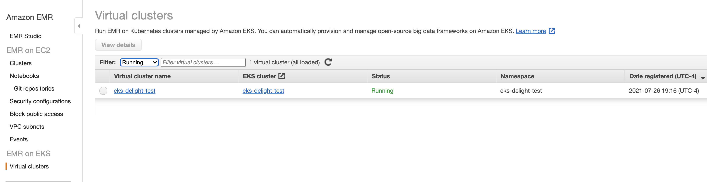
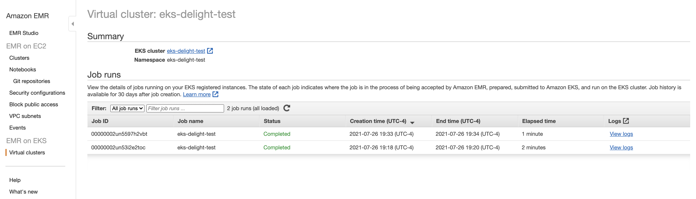

# Installation steps for AWS EMR on EKS

This document details instructions to install Delight on AWS EMR on EKS.

EMR on EKS currently only supports cluster/job creation through use of the aws emr-containers cli.

To submit a spark application, complete the following steps to initialize your cluster/environment:

- Provision a Kubernetes cluster
- Create a Kubernetes namespace specifically for emr deployments
- Create RBAC role for service emr-containers
  > ```
  > eksctl create iamidentitymapping \
  > --cluster <your cluster name>  \
  > --namespace <your namespace> \
  > --service-name "emr-containers”
  > ```
- Create job execution role and attache to cluster
  > ```
  > aws emr-containers update-role-trust-policy --cluster-name <cluster name> --namespace <namespace> --role-name <job execution role name>
  > ```
- Create an EMR virtual cluster; visit the EMR dashboard to view the virtual cluster

  > ```
  > aws emr-containers create-virtual-cluster \
  > 	--name <cluster name> \
  > 	--container-provider \
  > 	`{
  > 		“id”: <virtual cluster name>,
  > 		“type”: “EKS”,
  > 		“info”: {
  > 			“eksInfo”: {
  > 				“namespace”: <your namespace>
  > 			}
  > 			}
  > 	}’
  > ```

  > 

- Submit spark job to your virtual cluster(Including your Delight API Key), making sure to include the following spark configuration settings specific to Delight to the -job-driver argument of the api call

  > ```java
  > --packages io.montara.lucia:sparklistener_<replace-with-your-scala-version-2.11-or-2.12>:latest-SNAPSHOT
  > --repositories https://oss.sonatype.org/content/repositories/snapshots
  > --conf spark.extraListeners=io.montara.lucia.sparklistener.LuciaSparkListener
  > ```

  > ````
  > 	#### Example Start Job Run payload
  > aws emr-containers start-job-run \
  > --virtual-cluster-id \<cluster id returned by create virtual cluster execution> \
  > --name <name of spark job> \
  > --execution-role-arn <arn for job execution role> \
  > --release-label emr-6.2.0-latest \
  > --job-driver '{"sparkSubmitJobDriver": {"entryPoint": "local:///usr/lib/spark/examples/src/main/python/pi.py","sparkSubmitParameters": "--packages io.montara.lucia:sparklistener_2.12:latest-SNAPSHOT
  > --repositories https://oss.sonatype.org/content/repositories/snapshots \
  > --conf spark.extraListeners=io.montara.lucia.sparklistener.LuciaSparkListener \
  > --conf spark.executor.instances=<desired number of instances> \
  > --conf spark.executor.memory=<desired memory> \
  > --conf spark.executor.cores=<desired executor cores> \
  > --conf >spark.driver.cores=<desired driver cores>"}}' \
  > --configuration-overrides '{"monitoringConfiguration": {"cloudWatchMonitoringConfiguration": {"logGroupName": "emr-eks-delight"}}}'```
  > ````

- Go to the Jobs UI on your virtual cluster to view the status of your spark application, view logs, and access the spark UI

  > 

- Visit the Delight Dashboard and view your application metrics
  > 

Don't forget to replace the placeholders in the code!
Latest Spark distributions on EMR use Scala version 2.12.
