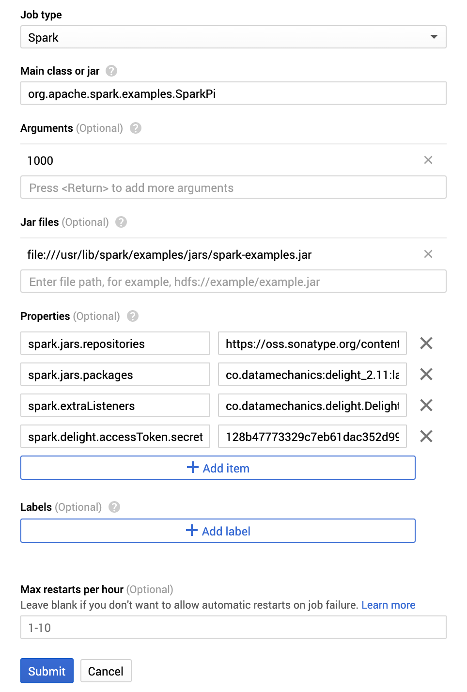

# Installation steps for Google Cloud Dataproc

This document details instructions to install Delight on Google Cloud Dataproc.

It assumes that you have created an account and generated an access token on the [Delight website](https://www.datamechanics.co/delight).

There are two ways to run Spark application on Dataproc:

- as a [job](https://cloud.google.com/dataproc/docs/concepts/jobs/life-of-a-job) on an existing cluster,
- as a Spark step in a [worflow](https://cloud.google.com/dataproc/docs/concepts/workflows/overview) run on an existing or an ephemeral cluster (so-called "managed" cluster)

We detail instructions for both cases below.

## First option: as a job on an existing cluster

Follow these [instructions to create a cluster and run a Spark job](https://cloud.google.com/dataproc/docs/quickstarts/quickstart-console).

When configuring the job, add the following properties to the application:
```
spark.jars.repositories: https://oss.sonatype.org/content/repositories/snapshots
spark.jars.packages: co.datamechanics:delight_<replace-with-your-scala-version-2.11-or-2.12>:latest-SNAPSHOT
spark.extraListeners: co.datamechanics.delight.DelightListener
spark.delight.accessToken.secret: <replace-with-your-access-token>
```

Don't forget to replace the placeholders!
The default Spark distribution on Dataproc uses Scala version 2.11.
Please refer to the [official Dataproc documentation](https://cloud.google.com/dataproc/docs/concepts/versioning/overview) to learn more about releases.



## Second option: as a Spark step in a workflow

Spark applications can be run as Spark steps in a worflow.
In this section, we create an example workflow template with a Spark step and execute it.

More details are available in [these instructions in the Dataproc documentation](https://cloud.google.com/dataproc/docs/concepts/workflows/using-workflows).
To enable Delight, we simply add some Spark properties to the Spark step.

The script below shows how to do this for an example Spark Pi application running on an ephemeral cluster.

Don't forget to replace the placeholders!
The default Spark distribution on Dataproc uses Scala version 2.11.
Please refer to the [official Dataproc documentation](https://cloud.google.com/dataproc/docs/concepts/versioning/overview) to learn more about releases.

```bash
TEMPLATE_NAME=delight-test-template
REGION=us-west1
CLUSTER_NAME=delight-test-cluster
PROPERTIES=(
    "spark.jars.repositories=https://oss.sonatype.org/content/repositories/snapshots"
    "spark.jars.packages=co.datamechanics:delight_<replace-with-your-scala-version-2.11-or-2.12>:latest-SNAPSHOT"
    "spark.extraListeners=co.datamechanics.delight.DelightListener"
    "spark.delight.accessToken.secret=<replace-with-your-access-token>"
)

function join { local IFS="$1"; shift; echo "$*"; }

gcloud dataproc workflow-templates create $TEMPLATE_NAME \
    --region=$REGION

gcloud dataproc workflow-templates set-managed-cluster $TEMPLATE_NAME \
    --region=$REGION \
    --master-machine-type=n1-standard-2 \
    --worker-machine-type=n1-standard-2 \
    --num-workers=2 \
    --cluster-name=$CLUSTER_NAME

gcloud dataproc workflow-templates add-job spark \
    --workflow-template=$TEMPLATE_NAME \
    --region=$REGION \
    --step-id=spark-step \
    --class=org.apache.spark.examples.SparkPi \
    --jars=file:///usr/lib/spark/examples/jars/spark-examples.jar \
    --properties=$(join "," ${PROPERTIES[@]}) \
    -- 1000

gcloud dataproc workflow-templates instantiate $TEMPLATE_NAME \
    --region=$REGION
```

Then move on to the [Dataproc console](https://console.cloud.google.com/dataproc/clusters) to see the cluster being created and the job execution.
